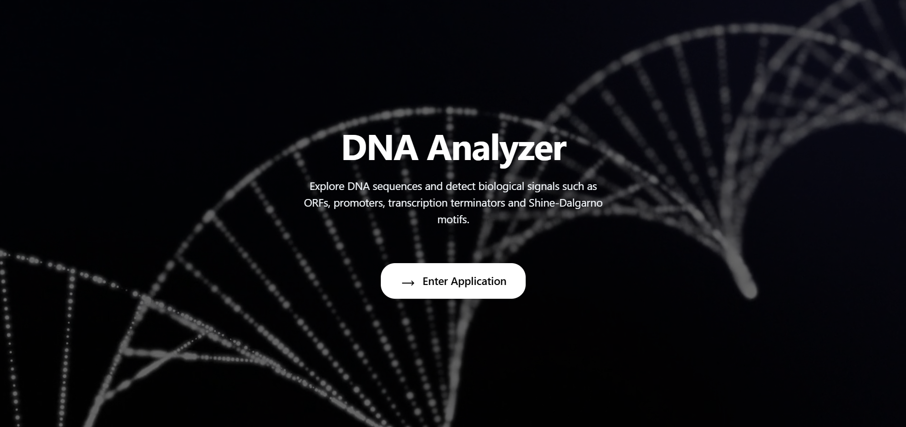
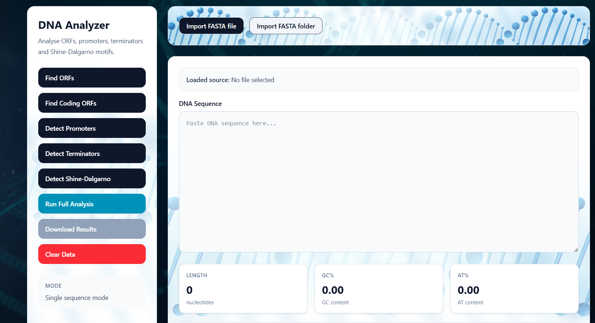
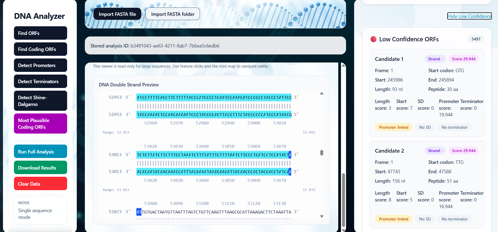
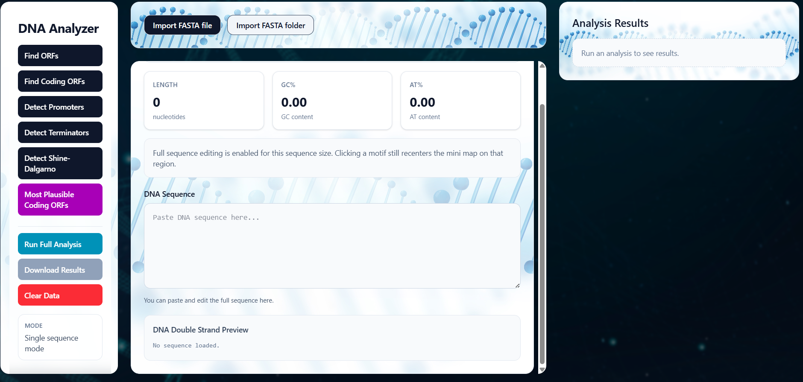
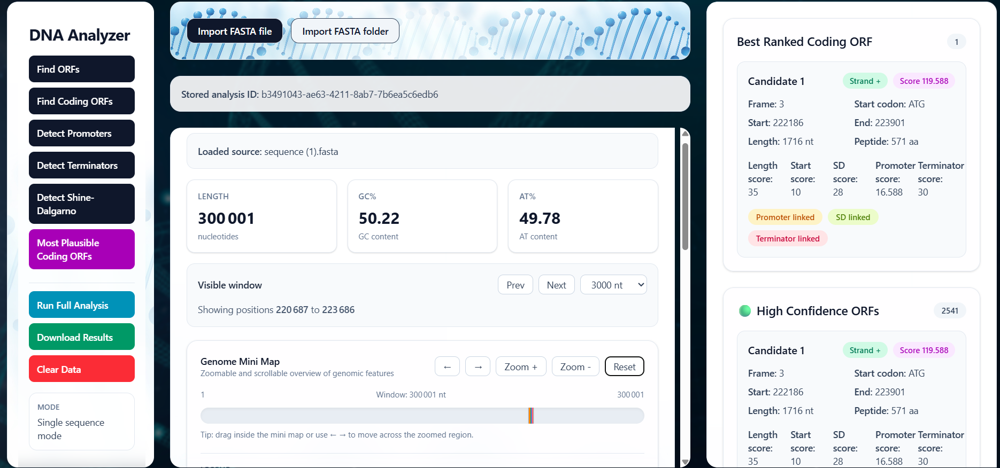
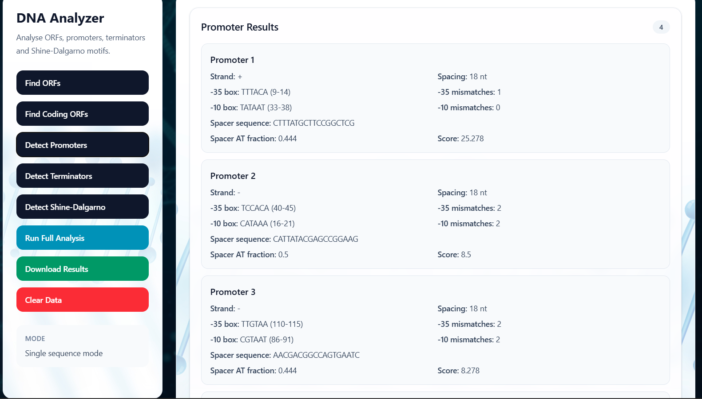
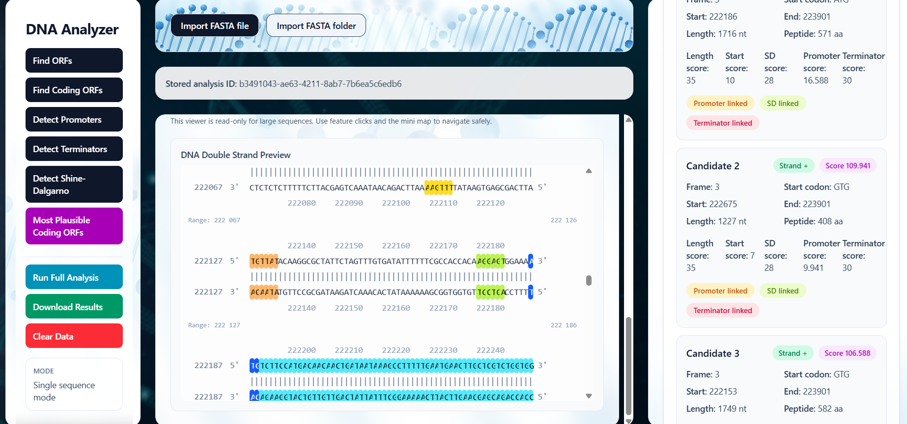

# DNA Analyzer

DNA Analyzer est une application bioinformatique full-stack permettant d’analyser une séquence d’ADN et de détecter plusieurs signaux biologiques impliqués dans l’expression des gènes bactériens.

L’application identifie automatiquement :

- ORFs (Open Reading Frames)
- codons start et stop
- promoteurs bactériens
- sites Shine-Dalgarno
- terminateurs de transcription rho-indépendants

L’analyse utilise plusieurs filtres biologiques afin que les résultats obtenus soient cohérents avec le contexte biologique réel.

Le frontend est développé avec React et le backend est développé avec Flask et Biopython.

---

# Fonctionnalités

## Détection des ORF

L’application recherche les ORF possibles dans les six cadres de lecture :

- trois frames sur le brin direct
- trois frames sur le brin complémentaire

Les ORF sont détectés en utilisant :

- les codons start possibles : ATG, GTG, TTG  
- les codons stop : TAA, TAG, TGA  
- une longueur minimale de protéine afin de réduire les faux positifs

Un filtrage biologique est appliqué afin de sélectionner les ORF potentiellement codants.

---

## Détection des promoteurs

L’application recherche des promoteurs bactériens de type sigma 70.

Box -35  
TTGACA

Box -10  
TATAAT

Les critères utilisés :

- tolérance de mismatches
- distance biologique correcte entre les deux boxes
- calcul d’un score biologique pour classer les promoteurs détectés

---

## Détection Shine-Dalgarno

Le site Shine-Dalgarno correspond au site de fixation du ribosome avant le codon start.

Séquence consensus :

AGGAGG

Contraintes biologiques appliquées :

- position située entre 7 et 9 nucléotides avant le codon start
- association automatique avec le codon start détecté
- filtrage des sites biologiquement plausibles

---

## Détection des terminateurs rho-indépendants

Les terminateurs rho-indépendants sont caractérisés par :

- une séquence palindromique capable de former une structure hairpin
- une région riche en GC
- une queue poly-T en aval

L’application détecte ces structures afin d’identifier les terminateurs possibles.

---

# Interface utilisateur

L’interface permet :

- le chargement d’une séquence ADN
- la visualisation des résultats
- la coloration des éléments biologiques détectés
- la navigation entre différents types de résultats
- la sélection d’un signal biologique pour le localiser dans la séquence

---

# Technologies utilisées

## Frontend

- React  
- TailwindCSS  
- Axios  

## Backend

- Python  
- Flask  
- Biopython  

---
# Objectif du projet

Ce projet démontre l’intégration de méthodes bioinformatiques dans une application web interactive.  
Il permet d’explorer les signaux biologiques impliqués dans l’expression des gènes bactériens tout en utilisant des technologies modernes de développement web.

---
# Screenshots

---

